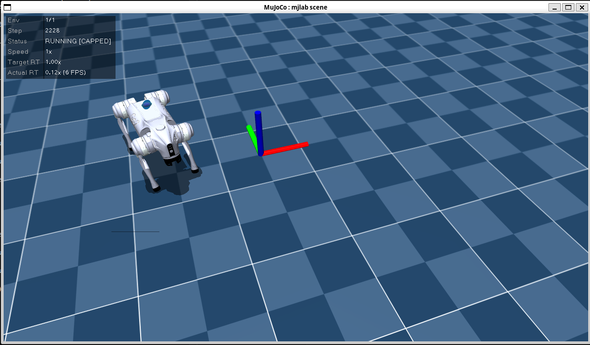
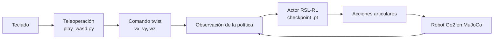

<div align="center">

# Unitree Go2 RL en MuJoCo

### Política de locomoción con RSL-RL y teleoperación local por teclado

**Ubuntu/WSL · Conda · MuJoCo · mjlab · PyTorch · RSL-RL**

<br>



<sub>Captura real de la ejecución del Go2 en el visor nativo de MuJoCo/mjlab.</sub>

</div>

---

Este proyecto ejecuta una política de aprendizaje por refuerzo para el robot
cuadrúpedo **Unitree Go2** dentro de **MuJoCo**. La política fue entrenada para
seguir comandos de velocidad y puede controlarse localmente con las flechas del
teclado, sin depender de servicios en la nube.

## Resultado

Al finalizar la guía se obtiene:

- una política entrenada cargada desde un checkpoint de RSL-RL;
- un entorno `Unitree-Go2-Flat` con un solo robot;
- visualización en el visor nativo de MuJoCo;
- control de avance, retroceso, giro y movimiento lateral;
- comandos manuales persistentes, sin remuestreo aleatorio durante la prueba.

## Arquitectura



Las teclas no controlan directamente las doce articulaciones. En su lugar,
definen una velocidad objetivo:

```text
twist = [velocidad_x, velocidad_y, velocidad_angular_z]
```

La política recibe ese comando junto con el estado del robot —IMU, gravedad
proyectada, posición y velocidad articular, fase de marcha y acción anterior— y
calcula las acciones articulares necesarias para desplazarse.

## Requisitos

### Plataforma

- Windows con **WSL** y una distribución Ubuntu, o Ubuntu nativo.
- Soporte gráfico para aplicaciones Linux. En Windows 11 normalmente lo
  proporciona WSLg.
- Miniconda o Anaconda.
- GPU compatible con CUDA recomendada; también puede utilizarse CPU si la
  instalación del proyecto lo permite.

### Software del proyecto

- repositorio `unitree_rl_mjlab`;
- MuJoCo y `mjlab`;
- PyTorch;
- RSL-RL;
- `tyro`;
- `pynput`, usado para capturar el teclado.

> [!IMPORTANT]
> Las versiones y el procedimiento de instalación de MuJoCo, `mjlab`, RSL-RL y
> PyTorch dependen de la revisión concreta del repositorio. Sigue primero el
> documento de instalación incluido en tu copia de `unitree_rl_mjlab`; esta guía
> comienza cuando el entorno del proyecto ya puede importar PyTorch y ejecutar
> `scripts/play.py`.

## Estructura esperada

```text
unitree_rl_mjlab/
├── assets/
│   └── go2-mujoco-simulation.png
├── scripts/
│   ├── train.py
│   ├── play.py
│   └── play_wasd.py
├── src/
│   └── tasks/
│       └── velocity/
├── logs/
│   └── rsl_rl/
│       └── go2_velocity/
│           └── 2026-07-27_22-18-58/
│               └── model_10000.pt
└── README.md
```

## 1. Preparar el entorno

Abre Ubuntu/WSL y activa únicamente el entorno Conda del proyecto:

```bash
conda activate unitree_rl_mjlab
cd ~/unitree_project/unitree_rl_mjlab
```

Verifica el intérprete y PyTorch:

```bash
which python
python -c "import torch; print(torch.__version__)"
```

El intérprete debe pertenecer al entorno `unitree_rl_mjlab`, por ejemplo:

```text
/home/areivan/miniconda3/envs/unitree_rl_mjlab/bin/python
```

Instala el lector de teclado dentro del mismo entorno:

```bash
python -m pip install pynput
```

## 2. Entrenar o seleccionar una política

La tarea utilizada por este proyecto es:

```text
Unitree-Go2-Flat
```

La entrada de entrenamiento es `scripts/train.py`. Consulta las opciones
disponibles en la revisión local del repositorio:

```bash
python scripts/train.py --help
```

Selecciona `Unitree-Go2-Flat` y conserva los parámetros de entrenamiento
recomendados por esa revisión. Los checkpoints resultantes se guardan bajo:

```text
logs/rsl_rl/go2_velocity/<fecha-hora>/model_<iteracion>.pt
```

Esta guía utiliza el checkpoint:

```text
logs/rsl_rl/go2_velocity/2026-07-27_22-18-58/model_10000.pt
```

Para listar los checkpoints por fecha de modificación:

```bash
find logs/rsl_rl -name "model_*.pt" -printf "%T@ %p\n" \
  | sort -n \
  | tail
```

También puedes seleccionar automáticamente el más reciente:

```bash
CHECKPOINT="$(
  find logs/rsl_rl -name "model_*.pt" -printf "%T@ %p\n" \
    | sort -n \
    | tail -1 \
    | cut -d' ' -f2-
)"

echo "$CHECKPOINT"
```

## 3. Probar el checkpoint

Antes de añadir teleoperación, comprueba la política con el reproductor base:

```bash
python scripts/play.py Unitree-Go2-Flat \
  --checkpoint-file logs/rsl_rl/go2_velocity/2026-07-27_22-18-58/model_10000.pt \
  --num-envs 1 \
  --viewer native
```

Esto abre un solo Go2 en el visor nativo de MuJoCo. El nombre de tarea debe
coincidir con el robot y la tarea usados durante el entrenamiento.

## 4. Crear el reproductor con teclado

Conserva intacto el reproductor original:

```bash
cp scripts/play.py scripts/play_wasd.py
```

En `scripts/play_wasd.py`, importa el lector de teclado:

```python
from pynput import keyboard
```

### Controlador de las flechas

Añade la siguiente clase después de `PlayConfig` y antes de `run_play`:

```python
class WasdPolicy:
  """Aplica comandos de velocidad del teclado antes de ejecutar la política."""

  def __init__(self, policy, env):
    self.policy = policy
    self.keys: set[str] = set()
    self.command_term = env.unwrapped.command_manager.get_term("twist")

    if self.command_term is None:
      raise RuntimeError("El entorno no contiene el comando 'twist'.")

    self.listener = keyboard.Listener(
      on_press=self._on_press,
      on_release=self._on_release,
    )
    self.listener.start()

    print("\n========== CONTROL DEL GO2 ==========")
    print("↑ / ↓      : avanzar / retroceder")
    print("← / →      : girar izquierda / derecha")
    print("Q / E      : desplazamiento lateral")
    print("ESPACIO    : detener")
    print("=====================================\n")

  @staticmethod
  def _key_name(key):
    try:
      return key.char.lower()
    except AttributeError:
      if key == keyboard.Key.up:
        return "up"
      if key == keyboard.Key.down:
        return "down"
      if key == keyboard.Key.left:
        return "left"
      if key == keyboard.Key.right:
        return "right"
      if key == keyboard.Key.space:
        return "space"
      return None

  def _on_press(self, key):
    name = self._key_name(key)
    if name is not None:
      self.keys.add(name)

  def _on_release(self, key):
    name = self._key_name(key)
    if name is not None:
      self.keys.discard(name)

  def __call__(self, obs):
    vx = 0.0
    vy = 0.0
    yaw = 0.0

    if "up" in self.keys:
      vx += 0.8
    if "down" in self.keys:
      vx -= 0.6
    if "q" in self.keys:
      vy += 0.5
    if "e" in self.keys:
      vy -= 0.5
    if "left" in self.keys:
      yaw += 0.8
    if "right" in self.keys:
      yaw -= 0.8

    if "space" in self.keys:
      vx = 0.0
      vy = 0.0
      yaw = 0.0

    command = torch.tensor(
      [vx, vy, yaw],
      device=self.command_term.vel_command_b.device,
      dtype=self.command_term.vel_command_b.dtype,
    )
    self.command_term.vel_command_b[:] = command

    return self.policy(obs)
```

Las velocidades propuestas se encuentran dentro de los rangos observados
durante el entrenamiento:

```text
lin_vel_x: [-1.0, 2.0] m/s
lin_vel_y: [-1.0, 1.0] m/s
ang_vel_z: [-1.0, 1.0] rad/s
```

## 5. Mantener el comando manual

Durante el entrenamiento, el entorno cambia automáticamente el comando `twist`
para presentar objetivos variados a la política. En reproducción manual se
desactiva ese comportamiento para que el teclado sea la única fuente de
comandos.

Dentro de `run_play`, inmediatamente después de cargar `env_cfg` y antes de
crear `ManagerBasedRlEnv`, agrega:

```python
  env_cfg = load_env_cfg(task_id, play=True)
  agent_cfg = load_rl_cfg(task_id)

  # El teclado controla el comando twist durante toda la reproducción.
  if "twist" in env_cfg.commands:
    twist_cfg = env_cfg.commands["twist"]

    twist_cfg.heading_command = False
    twist_cfg.ranges.heading = None
    twist_cfg.rel_heading_envs = 0.0
    twist_cfg.rel_standing_envs = 0.0
    twist_cfg.resampling_time_range = (1_000_000.0, 1_000_000.0)
```

`heading_command` y `ranges.heading` se desactivan juntos porque ahora el giro
se expresa directamente como velocidad angular `yaw`.

## 6. Conectar el teclado con la política

Después de cargar el checkpoint, envuelve la política de inferencia:

```python
    policy = runner.get_inference_policy(device=device)
    policy = WasdPolicy(policy, env)
```

El flujo final queda así:

```text
teclado → vel_command_b → observación → política → acciones → MuJoCo
```

Comprueba la sintaxis antes de iniciar la simulación:

```bash
python -m py_compile scripts/play_wasd.py
```

## 7. Ejecutar con teleoperación

```bash
python scripts/play_wasd.py Unitree-Go2-Flat \
  --checkpoint-file logs/rsl_rl/go2_velocity/2026-07-27_22-18-58/model_10000.pt \
  --num-envs 1 \
  --viewer native
```

Haz clic en la ventana de MuJoCo y mantén presionada una tecla para ordenar una
velocidad.

## Controles

| Tecla | Acción | Comando |
|:---:|---|---:|
| `↑` | Avanzar | `vx = +0.8 m/s` |
| `↓` | Retroceder | `vx = -0.6 m/s` |
| `←` | Girar a la izquierda | `wz = +0.8 rad/s` |
| `→` | Girar a la derecha | `wz = -0.8 rad/s` |
| `Q` | Desplazamiento lateral izquierdo | `vy = +0.5 m/s` |
| `E` | Desplazamiento lateral derecho | `vy = -0.5 m/s` |
| `Espacio` | Detenerse | `[0.0, 0.0, 0.0]` |

Se pueden combinar teclas. Por ejemplo, `↑` + `←` ordena avanzar mientras el
Go2 gira a la izquierda.

## Funcionamiento local

La inferencia, la simulación y la visualización se ejecutan en el equipo local.
No es necesario sincronizar las ejecuciones de Weights & Biases para reproducir
un checkpoint guardado en `logs/rsl_rl`.

Si el entrenamiento registra W&B en modo offline, sus archivos pueden
permanecer bajo:

```text
wandb/offline-run-*/
```

Esto no afecta la carga local del archivo `.pt`.

## Resultado esperado

Al iniciar la reproducción:

1. se crea un entorno en `cuda:0` si CUDA está disponible;
2. se carga `model_10000.pt`;
3. se abre el visor nativo;
4. el Go2 adopta su postura y ejecuta la política;
5. las flechas y `Q/E` actualizan el objetivo `twist`;
6. la política coordina las articulaciones para seguir la velocidad solicitada.

## Lista de verificación

- [ ] El entorno activo se llama `unitree_rl_mjlab`.
- [ ] `python -c "import torch"` se ejecuta correctamente.
- [ ] El checkpoint pertenece a `go2_velocity`.
- [ ] La tarea seleccionada es `Unitree-Go2-Flat`.
- [ ] La reproducción utiliza `--num-envs 1`.
- [ ] El visor seleccionado es `native`.
- [ ] `twist` no remuestrea comandos durante la teleoperación.
- [ ] Las flechas controlan avance y giro.
- [ ] `Q/E` controlan el movimiento lateral.
- [ ] Espacio detiene el robot.

## Próximos pasos

- suavizar los cambios de velocidad con una rampa o filtro de primer orden;
- añadir límites configurables desde la línea de comandos;
- incorporar soporte para gamepad;
- mostrar en pantalla `vx`, `vy` y `wz`;
- grabar episodios de evaluación en video;
- probar la política sobre terreno irregular;
- publicar comandos desde ROS 2 mediante `cmd_vel`;
- exportar la política a ONNX para despliegue;
- preparar una evaluación Sim2Real con límites de seguridad específicos del
  robot físico.

> [!CAUTION]
> Una política estable en simulación no debe transferirse directamente al robot
> físico sin revisar orden de articulaciones, escalas, frecuencia de control,
> límites, estado de emergencia y procedimiento Sim2Real.

---

<div align="center">

**Unitree Go2 · Reinforcement Learning · MuJoCo**

</div>
